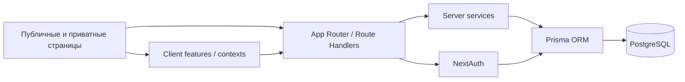

<p align="center">
  
</p>

<h1 align="center">БГИТУ Афиша</h1>

<p align="center">
  Единая веб-платформа БГИТУ для публикации, модерации и сопровождения университетских мероприятий.
</p>

<p align="center">
  Публичная афиша · Календарь · Новости · Уведомления · Админ-панель
</p>

<p align="center">
  
  
  
  
  
</p>

<p align="center">
  <a href="#быстрый-старт">Быстрый старт</a> ·
  <a href="#основные-возможности">Возможности</a> ·
  <a href="#структура-проекта">Структура</a> ·
  <a href="#скрипты">Скрипты</a> ·
  <a href="#деплой">Деплой</a>
</p>

<table>
  <tr>
    <td align="center" width="33%">
      <strong>Публичный контур</strong><br />
      Открытая афиша, фильтры, карточки событий и быстрый вход в систему.
    </td>
    <td align="center" width="33%">
      <strong>Рабочий контур</strong><br />
      Dashboard, календарь, новости, профиль, участие в событиях и отчётах.
    </td>
    <td align="center" width="33%">
      <strong>Админ-контур</strong><br />
      Импорт, аудит, метрики, диагностика, управление структурой и пользователями.
    </td>
  </tr>
</table>

## О проекте

`bgitu-afisha` собирает в одном интерфейсе жизненный цикл кампусных событий: от публикации анонса и набора участников до новостной публикации, отчёта и административной аналитики.

Проект построен на `Next.js App Router`, использует `Prisma` для доменной модели и `NextAuth` для аутентификации через локальные учётные записи и OAuth-провайдеров.

## Основные возможности

<table>
  <tr>
    <td width="50%">
      <strong>Публичная афиша</strong><br />
      Просмотр открытых мероприятий без авторизации, фильтры по дате, категории и подразделению.
    </td>
    <td width="50%">
      <strong>Личный кабинет</strong><br />
      Dashboard с поиском, календарём, ближайшими событиями и архивом материалов.
    </td>
  </tr>
  <tr>
    <td width="50%">
      <strong>Управление событиями</strong><br />
      Создание, редактирование, модерация, назначение ответственных и участников.
    </td>
    <td width="50%">
      <strong>Новости и отчёты</strong><br />
      Новостная лента на базе завершённых мероприятий и опубликованных отчётов.
    </td>
  </tr>
  <tr>
    <td width="50%">
      <strong>Уведомления</strong><br />
      Внутрисистемные уведомления, настройка каналов доставки, интеграция с VK и email webhook.
    </td>
    <td width="50%">
      <strong>Администрирование</strong><br />
      Метрики, аудит, импорт пользователей, событий и новостей, диагностика и экспорт данных.
    </td>
  </tr>
</table>

## Роли и доступ

| Роль | Возможности |
| --- | --- |
| `STUDENT` | Просмотр афиши, участие в событиях, профиль, уведомления |
| `TEACHER` | Создание и сопровождение мероприятий |
| `MODERATOR` | Модерация и участие в публикационном процессе |
| `EDITOR` | Контентное сопровождение и выпуск материалов |
| `ADMIN` | Полный доступ к `/admin`, пользователям, метрикам, структуре и импортам |

Публичная регистрация отключена: основной вход рассчитан на `Credentials`, `Yandex OAuth` и `MAX OAuth`, а тестовые пользователи поднимаются через сидинг.

## Стек

- `Next.js 16` и `React 19` для UI, SSR/CSR и API routes
- `TypeScript` со строгой типизацией по всем слоям
- `Prisma ORM` + `PostgreSQL` для доменной модели и миграций
- `NextAuth.js` для сессий, ролей и OAuth-аутентификации
- `Tailwind CSS` для интерфейса
- `ESLint`, `tsx` и smoke-сценарии для базовой проверки качества

## Архитектура



Архитектура держит тонкие route handlers в `src/app/api/**`, серверную бизнес-логику в `src/server/**`, клиентские адаптеры в `src/features/**` и общие типы в `src/types/**`.

## Быстрый старт

```bash
cp .env.example .env.local
npm install
npx prisma db push
npm run db:seed   # опционально
npm run dev
```

После запуска приложение доступно на `http://localhost:3000`.

## Переменные окружения

| Переменная | Обязательность | Назначение |
| --- | --- | --- |
| `DATABASE_URL` | обязательно | Основная строка подключения к PostgreSQL |
| `DIRECT_URL` | рекомендуется | Прямое подключение для миграций Prisma |
| `NEXTAUTH_URL` | обязательно | Базовый URL приложения |
| `NEXTAUTH_SECRET` | обязательно | Секрет для подписи NextAuth-сессий |
| `YANDEX_CLIENT_ID`, `YANDEX_CLIENT_SECRET` | опционально | Вход через Яндекс |
| `MAX_CLIENT_ID`, `MAX_CLIENT_SECRET`, `MAX_*_URL` | опционально | Вход через MAX OAuth |
| `VK_GROUP_TOKEN` | опционально | Отправка уведомлений во VK |
| `EMAIL_NOTIFICATION_WEBHOOK_URL` | опционально | Внешняя доставка email-уведомлений |
| `NEXT_PUBLIC_ENABLE_DEMO` | опционально | Включение демо-режима на странице входа |
| `ADMIN_SEED_*`, `TEACHER_SEED_*` | опционально | Настройки тестового наполнения через `db:seed` |

Подробный шаблон находится в `.env.example`.

## Скрипты

| Команда | Что делает |
| --- | --- |
| `npm run dev` | Запускает локальный dev-сервер |
| `npm run build` | Собирает production-версию |
| `npm run start` | Запускает production-сборку |
| `npm run lint` | Проверяет код через ESLint |
| `npm run type-check` | Проверяет TypeScript без генерации файлов |
| `npm run db:push` | Применяет схему Prisma к БД |
| `npm run db:generate` | Перегенерирует Prisma Client |
| `npm run db:seed` | Создаёт тестовые данные |
| `npm run test:smoke` | Запускает API и E2E smoke-проверки |
| `npm run format` | Форматирует проект через Prettier |

## Структура проекта

```text
src/
  app/           страницы, layout, route handlers
  components/    UI и крупные экранные компоненты
  contexts/      клиентские state-контексты
  features/      клиентские API-адаптеры по доменам
  lib/           auth, prisma, роли, утилиты
  server/        серверные сервисы и доменная логика
  styles/        глобальные стили
  types/         DTO, доменные типы и API-контракты
prisma/          schema, seed, миграции
tests/smoke/     smoke-сценарии
docs/            технические и защитные материалы по проекту
```

## Качество

| Проверка | Назначение |
| --- | --- |
| `npm run lint` | Контроль стиля, ошибок и неаккуратных изменений |
| `npm run type-check` | Проверка целостности TypeScript-контрактов |
| `npm run test:smoke` | Быстрый прогон критических API и E2E-сценариев |

Базовый безопасный цикл перед релизом: `lint` → `type-check` → `build` → `smoke`.

## Ключевые маршруты

| Маршрут | Назначение |
| --- | --- |
| `/` и `/afisha` | Публичная афиша мероприятий |
| `/dashboard` | Основной рабочий экран авторизованного пользователя |
| `/events` | Список событий и переход в карточки |
| `/events/create` | Создание нового мероприятия |
| `/calendar` | Календарное представление |
| `/news` | Лента новостей и отчётов |
| `/notifications` | Центр уведомлений |
| `/profile` | Личный профиль и настройки уведомлений |
| `/admin` | Административная панель |
| `/legal/terms`, `/legal/privacy` | Юридические страницы |

## Деплой

Для продакшена достаточно:

1. Подключить проект к платформе деплоя.
2. Передать production-значения `DATABASE_URL`, `DIRECT_URL`, `NEXTAUTH_URL`, `NEXTAUTH_SECRET`.
3. Выполнить миграции через `npx prisma migrate deploy`.
4. Проверить `npm run build` перед релизом.

## Документация

- `docs/PROJECT_TECHNICAL_DEFENSE_RU.md` — техническая защита проекта
- `docs/PROJECT_DEFENSE_PRESENTATION_RU.md` — план презентации
- `docs/bgitu-afisha-article.md` — расширенное описание решения
- `docs/external-notifications.md` — заметки по внешним уведомлениям
